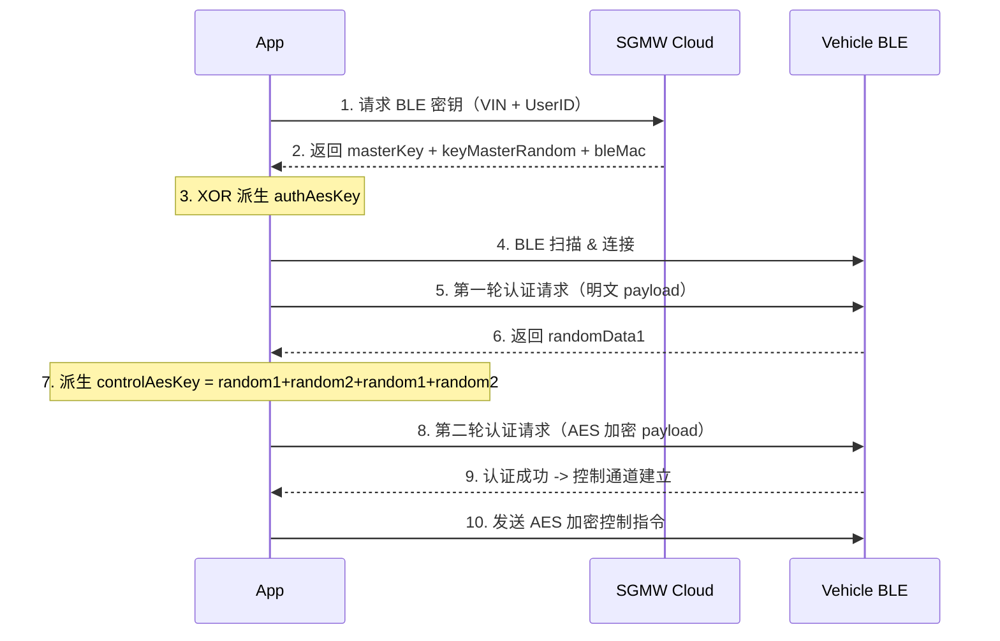

# 仅供学习交流用途

# BaoJun-BLE-CarKey

一个基于宝骏（SGMW）BLE 数字钥匙协议的 iOS 车控应用，通过蓝牙低功耗（BLE）与车辆建立安全连接，实现手机控车。

---

## 功能概览

| 模块 | 说明 |
|------|------|
| BLE 数字钥匙 | 基于 AES-128 的两轮挑战-应答认证，安全解锁/锁定车辆 |
| 车辆控制 | 远程车门锁止/解锁、车辆断电等控制指令 |
| 车辆状态 | 实时展示车辆连接状态、车门状态等信息 |
| 车辆定位 | MapKit 地图显示车辆位置，支持 WGS84/GCJ02/BD09 坐标转换 |
| 用户系统 | SGMW 统一认证登录、Token 管理、数字钥匙查询与绑定 |
| 云服务 | 通过 SGMW REST API 获取车辆状态、下发 BLE 密钥 |

## 技术架构

```
+-------------------------------------------+
|              SwiftUI Layer                 |
|  CarControlsView - ContentView - MapView   |
+-------------------------------------------+
|           ViewModel / Manager              |
|  BluetoothManager - DataManager            |
|  NetworkManager - SGMWUnifiedOAuth         |
+-------------------------------------------+
|              Service Layer                 |
|  BLE (CoreBluetooth) - URLSession - GPS    |
+-------------------------------------------+
|         Third-Party Libraries              |
|  CryptoSwift - SwiftyBluetooth - LogView   |
+-------------------------------------------+
```

- **架构模式**：MVVM，通过 `ObservableObject` + `@Published` 实现响应式数据绑定
- **BLE 通信**：基于 CoreBluetooth，自定义 GATT 服务（授权服务 `181A` + 控制服务 `182A`），支持 Write/Notify 双通道
- **安全机制**：云端下发 AES 密钥 -> 本地 XOR 派生 -> 两轮 Challenge-Response 认证 -> 会话密钥派生控制指令加密
- **网络层**：协议化 `EndpointType` 设计，`NetworkManager` 单例管理 `URLSession`，支持泛型 JSON 解析

## 项目结构

```
carkey/
├── carkeyApp.swift              # App 入口
├── Bluetooth/
│   ├── BtThing.swift            # BLE 管理器（扫描/连接/认证/控制）
│   └── BtData.swift             # BLE 协议数据结构 & AES 加解密
├── Data/
│   ├── Data.swift               # 数据模型 & DataManager 单例
│   └── SGMW.swift               # SGMW 统一认证（签名/Token/OAuth）
├── Net/
│   ├── NetThing.swift           # 网络请求管理 & API Endpoint 定义
│   └── NetUtil.swift            # MD5 / 随机字符串 / 设备标识
├── View/
│   ├── ContentView.swift        # 主 Tab 页面（车辆信息/蓝牙密钥/用户信息）
│   ├── CarControl.swift         # 车辆控制页（状态展示/控制按钮/地图）
│   └── UserView.swift           # 用户个人中心页
├── t/
│   ├── ViewIndicator.swift      # 状态指示器组件
│   └── ViewMap.swift            # MapKit 地图组件
└── Util/
    └── helper.swift             # GPS 坐标转换工具（WGS84<->GCJ02<->BD09）
```

---

## BLE 安全认证流程



## 声明

本项目仅供学习交流使用，不应用于任何商业或违法用途。所有 API 接口及协议版权归上汽通用五菱（SGMW）所有。

# Swift写起来真是太爽了你们知道吗
